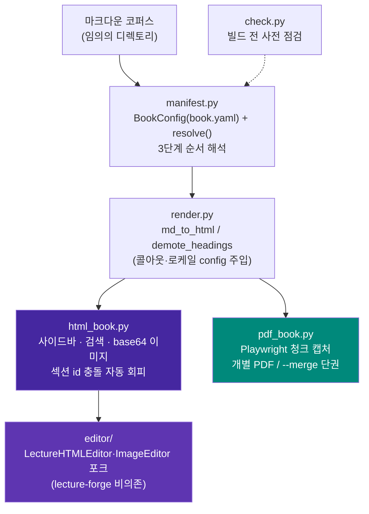

# Book-binder

[](LICENSE)

**임의의 마크다운 코퍼스를 검색 가능한 단일 HTML 도서와 PDF(단권/병합)로 변환하고,
결과 HTML을 편집하는 범용 애플리케이션.**

---

## 목차

- [1. 프로젝트 개요](#1-프로젝트-개요)
  - [왜 만들었나](#왜-만들었나)
  - [아키텍처](#아키텍처)
  - [설계 원칙](#설계-원칙)
  - [파일 구조](#파일-구조)
- [2. 핵심 기능 및 사용법](#2-핵심-기능-및-사용법)
  - [순서 해석 — 3단계 우선순위](#순서-해석--3단계-우선순위)
  - [book.yaml 설정](#bookyaml-설정)
  - [빌드 전 사전 점검 — check](#빌드-전-사전-점검--check)
  - [HTML 도서 빌드](#html-도서-빌드)
  - [PDF 빌드 — 개별/병합](#pdf-빌드--개별병합)
  - [HTML 편집](#html-편집)
- [3. 설치 가이드](#3-설치-가이드)
- [알려진 한계](#알려진-한계)
- [라이선스](#라이선스)

---

## 1. 프로젝트 개요

### 왜 만들었나

`Book_forge/Book`, `Agent-Evaluator/Media/Book`, `Agent-Evaluator/Media/AOO` 세
프로젝트에 각각 `build_book.py`/`build_pdf_chapters.py`(총 ~5,600줄)가 따로
존재했다 — 전부 같은 조상에서 복붙된 뒤 서로 다르게 갈라진 **사실상 동일한
엔진의 사본**이었다. 목차 정의는 책마다 손으로 유지하는 Python 리스트였고,
이미지 임베드 방식·콜아웃 인식 규칙도 세 곳이 미묘하게 달랐다.

Book-binder는 이 엔진을 한 곳으로 뽑아낸 **독립 애플리케이션**이다. 세 프로젝트
중 어느 하나도 이 빌드 엔진을 소유하지 않고, 전부 이 패키지를 의존성으로
참조한다. 목표는 세 가지였다.

1. 마크다운 문서를 HTML 도서·PDF 도서로 만드는 **일반화된** 애플리케이션 —
   새 마크다운 파일이 추가돼도 코드 수정 없이 반영되어야 한다.
2. HTML 도서는 이미지·다이어그램을 바이너리(base64)로 포함해 검색이 가능해야
   하고, PDF는 단권 또는 병합(merge)을 지원해야 한다.
3. 생성된 HTML 도서는 (Lecture_forge의 `edit_book.py` 기반) 편집이 가능해야
   한다.

### 아키텍처



`html_book.py`가 출력하는 `<section class="chapter-section" id="{slug}">`
구조는 `editor/`가 의존하는 **유일한 불변 계약**이다 — 다른 무엇을 바꾸더라도
이 마크업 계약은 유지해야 편집기가 섹션을 인식한다.

### 설계 원칙

1. **순서 해석은 3단계 우선순위**로 자동 결정된다 — 코드 수정 없이 새
   마크다운 파일이 반영되도록 하는 것이 핵심 목표다.
   1. 명시적 `book.yaml`(`order.manifest` 또는 `order.files`)
   2. `book.yaml`이 없어도 루트에 ` ```toc ` 펜스 매니페스트(Book-forge 목차
      포맷)가 있으면 자동 채택
   3. `Part_<로마숫자>_.../Chapter_<NN>_...` 명명 규칙 감지
   4. 위 전부 실패 시 디렉토리 트리 전체를 자연정렬(natural sort)해 전부
      포함 — "새 파일이 조용히 누락되는 일"을 구조적으로 없애는 최종 폴백
2. **책마다 다른 값(제목/저자/언어/제외 패턴/콜아웃 마커/커스텀 CSS)은 전부
   `book.yaml`로 외부화** — 렌더링 엔진(`render.py`) 코드는 어떤 코퍼스에도
   수정 없이 동작해야 한다.
3. **섹션 ID는 기본적으로 H1/파일명 slug 자동 생성**, 충돌 시 자동으로
   `-2`/`-3` 접미사를 붙인다 — 수작업 매핑 테이블은 "예쁜 URL을 원할 때만
   쓰는 선택적 오버라이드"로 격하한다.
4. **편집기는 lecture-forge에 비의존** — `Lecture_forge`의
   `LectureHTMLEditor`/`ImageEditor`를 포크하되 벡터스토어 기반 이미지 추천
   등 강의 특화 기능은 제외했다.

### 파일 구조

```
Book_binder/
├── pyproject.toml
├── LICENSE
├── README.md
├── src/book_binder/
│   ├── manifest.py          # BookConfig(book.yaml) + resolve()/resolve_verbose()
│   ├── render.py             # md_to_html / demote_headings / 콜아웃·로케일
│   ├── html_book.py          # HTML 도서 빌더 (사이드바/검색/base64 이미지)
│   ├── pdf_book.py           # PDF 빌더 (청크 캡처 + 개별/병합)
│   ├── check.py              # 빌드 전 사전 점검
│   ├── cli.py                # book-binder CLI (check/build html/build pdf/edit)
│   ├── editor/                # Lecture_forge 포크 — lecture-forge 비의존
│   │   ├── html_editor.py      # BookHTMLEditor — 섹션 CRUD
│   │   ├── image_editor.py     # 이미지/다이어그램 편집
│   │   └── server.py           # Flask 편집 API 서버
│   └── templates/
│       ├── html_book.css/js    # HTML 도서 사이드바·검색·mermaid
│       ├── pdf_override.css/js # PDF 전용 레이아웃 오버라이드
│       └── editor/              # 편집 SPA (index.html/editor.css/editor.js)
└── tests/
    ├── test_manifest.py       # 3단계 순서 해석 (5건)
    ├── test_html_book.py      # 섹션 id 충돌 회피·이미지 임베드 (3건)
    └── test_check.py          # 사전 점검 (4건)
```

---

## 2. 핵심 기능 및 사용법

### 순서 해석 — 3단계 우선순위

명령은 코퍼스가 무엇이든 동일하다(`book-binder build html <root>`) — 코퍼스가
이미 가진 정보(매니페스트/명명 규칙)에 따라 내부적으로 다른 우선순위가 자동
선택된다.

```bash
# book.yaml도, 매니페스트도, Part/Chapter 명명 규칙도 없는 새 폴더
book-binder build html ~/Docs/my-notes
# → 3순위(자연정렬)가 자동 적용, 최소한 파일이 빠지는 일은 없다
```

### book.yaml 설정

코퍼스 루트에 선택적으로 둔다 — 없어도 전부 기본값/자동 감지로 동작한다.

```yaml
title: "실전 AI 에이전트 하네스 엔지니어링"
author: "Sungwoo Kim"
language: ko                # ko/en — 검색 UI 문자열 로케일

order:                       # 1순위 — 있으면 이걸로 순서 확정
  files: [00_서문.md, Part_I_.../Chapter_01_*.md, ...]
  # 또는: manifest: 01_목차.md  ( ```toc 펜스 매니페스트 파일 지정 )

exclude:                     # 챕터가 아닌 문서 제외 (glob 패턴)
  - "README.md"
  - "IMAGES.md"

callouts:
  tip_markers: ["👨‍💻", "📋", "📊", "🔧", "🚨", "💡"]   # 없으면 전부 blockquote로 렌더

section_id_overrides:        # 파일 stem → 원하는 URL slug (선택)
  "Chapter_01_서론": "intro"

custom_css: custom.css       # 코퍼스 루트 기준 상대 경로 (선택)
                              # 코퍼스별 raw-HTML 다이어그램(@@HTML_START@@ 블록)이
                              # 쓰는 커스텀 클래스는 범용 템플릿에 넣을 수 없으므로,
                              # 여기 지정한 CSS 파일 내용을 HTML/PDF 빌드 모두에 그대로 얹는다.
```

### 빌드 전 사전 점검 — check

실제로 HTML을 렌더링하지 않고 원본 마크다운만 훑어 빠르게 확인한다 — 챕터가
아닌 문서(예: 집필 가이드 `.md`)가 잘못 포함되는 것을 빌드 후에야 발견하는
일을 줄인다.

```bash
book-binder check ~/Docs/my-book
```

```
순서 해석: 2순위: Part/Chapter 명명 규칙 감지
챕터 수: 44개

[Part I]
  - Part_I_기초/Chapter_01_...md
  ...

⚠️  같은 제목을 쓰는 챕터 1건 (빌드 시 id에 -2, -3... 자동 부여됨):
   - "개요": Part_I_.../Chapter_01_x.md, Part_II_.../Chapter_01_y.md
```

### HTML 도서 빌드

```bash
book-binder build html <코퍼스_루트> [--out out.html] [--title ...] [--language ko|en]
```

- 이미지를 base64 data URI로 인라인 임베드 — 이미지 폴더 없이도 단일 파일로
  완전히 독립적으로 열린다(다른 PC로 옮기거나 이메일 첨부해도 그대로 열림).
- 인페이지 전문 검색(하이라이트·이전/다음 이동), Mermaid 다이어그램 렌더링,
  사이드바 목차 자동 생성.
- 서로 다른 Part의 챕터 제목이 우연히 같아도(예: "개요") 섹션 id 충돌을
  자동으로 회피한다.
- 빌드 끝에 누락된 이미지 참조를 한 번에 모아 요약 출력한다.

### PDF 빌드 — 개별/병합

```bash
book-binder build pdf <코퍼스_루트>                        # 챕터별 개별 A4 PDF
book-binder build pdf <코퍼스_루트> --merge [이름]          # 단권으로 병합
book-binder build pdf <코퍼스_루트> --out-dir <디렉토리>    # 출력 위치 지정
```

각 챕터를 Playwright/Chromium으로 독립 렌더링한다. 긴 Mermaid 다이어그램은
청크 단위로 스크린샷 캡처해 삽입해 페이지 경계에서 잘리는 문제를 피한다.
병합도 각 챕터를 동일한 코드 경로로 개별 렌더링한 뒤 pypdf로 PDF 객체
레벨에서 합쳐, 개별 생성과 병합 생성의 폰트 크기·다이어그램 해상도가 항상
동일하다.

### HTML 편집

```bash
book-binder edit <html_경로> [--port 5757] [--out edited.html] [--no-browser]
```

브라우저에서 섹션 단위로 마크다운 편집(EasyMDE), 이미지/다이어그램 목록·삭제·
교체, 이미지 업로드/갤러리를 제공한다. `<section id="{slug}">` 구조에만
의존하므로 어떤 코퍼스로 만든 HTML이든 동일하게 동작한다.

---

## 3. 설치 가이드

Book-binder는 아직 PyPI에 배포되지 않았다 — 저장소를 직접 받아 설치한다.

### 사전 준비

- **Python 3.11 이상**
- **PDF 빌드(`[pdf]` extra)를 쓸 경우**: Playwright Chromium의 런타임 공유
  라이브러리가 필요하다. `python -m playwright install --with-deps chromium`
  하나로 브라우저와 OS 의존성을 한 번에 설치하는 것을 권장한다. 리눅스에서
  `--with-deps`를 못 쓰는 제한된 환경이라면 Ubuntu 22.04/24.04 기준 아래
  패키지가 대략 필요하다(버전에 따라 패키지명이 다를 수 있어 참고용):

  ```bash
  sudo apt install -y \
    libnss3 libnspr4 libatk1.0-0 libatk-bridge2.0-0 libcups2 \
    libdrm2 libdbus-1-3 libxcb1 libxkbcommon0 libx11-6 \
    libxcomposite1 libxdamage1 libxext6 libxfixes3 libxrandr2 \
    libgbm1 libpango-1.0-0 libcairo2 libasound2
  ```

  macOS는 별도 시스템 패키지 없이 `playwright install chromium`만으로 충분하다.

### 설치

```bash
git clone git@github.com:bullpeng72/book-binder.git
cd book-binder
python3 -m venv .venv && source .venv/bin/activate

pip install -e .                    # 코어만 — HTML 빌드/check/편집(수동 조합)
pip install -e ".[pdf]"             # + Playwright/pypdf (PDF 빌드용)
pip install -e ".[editor]"          # + Flask/Pillow (웹 편집기용)
pip install -e ".[dev]"             # + pytest/ruff (개발용)
pip install -e ".[pdf,editor,dev]"  # 전체 기능

python -m playwright install --with-deps chromium   # [pdf] 설치 시 1회
```

### 빠른 시작

```bash
book-binder check ~/Docs/my-book                 # 1. 빌드 전 사전 점검
book-binder build html ~/Docs/my-book --out out.html   # 2. HTML 도서 빌드
book-binder edit out.html                        # 3. 브라우저에서 편집
book-binder build pdf ~/Docs/my-book --merge      # 4. (선택) 단권 PDF
```

### 개발

```bash
pip install -e ".[dev,pdf,editor]"
pytest tests/ -q      # 12개 테스트 (manifest 5 + html_book 3 + check 4)
ruff check src tests
```

---

## 알려진 한계

- **PDF/HTML 부분 빌드 미지원**: 원본 `build_pdf_chapters.py`가 갖고 있던
  "파일/패턴 지정 부분 변환"은 아직 이식하지 않았다 — 항상 코퍼스 전체를
  대상으로 빌드한다.
- **마크다운 스캐폴딩(정형 스텁 생성) 미포함**: 의도적으로 범위에서 제외했다
  (Book-forge 자체 저작 파이프라인과 중복 방지 목적) — 새 챕터 파일은 손으로
  작성해야 한다.
- **`Part_<로마숫자>_...` 명명 규칙 감지(2순위)는 `Appendix/`만 특별 취급**:
  그 외 비-Part 디렉토리는 3순위 자연정렬로만 잡힌다 — 필요하면 `book.yaml`의
  `order.files`로 명시하는 게 안전하다.
- **`pdf_book.py`/`editor/`는 자동화된 회귀 테스트가 없다**: 실제 코퍼스로
  수동 검증(Flask test client, Playwright 실제 렌더링)은 마쳤지만
  `manifest.py`/`html_book.py`/`check.py`만큼 pytest로 고정돼 있지는 않다.
- **PyPI 미배포**: 현재는 git clone + 로컬 편집 가능 설치만 지원한다.

---

## 라이선스

MIT — [LICENSE](LICENSE) 참고.
