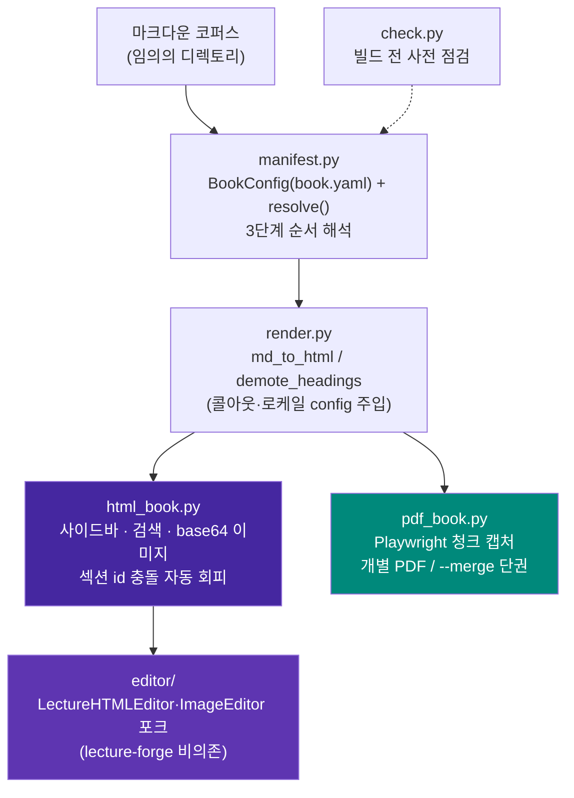

# MDBook-binder

[](https://pypi.org/project/mdbook-binder/)
[](LICENSE)

**임의의 마크다운 코퍼스를 검색 가능한 단일 HTML 도서와 PDF(단권/병합)로 변환하고,
결과 HTML을 편집하는 범용 애플리케이션.**

---

## 목차

- [1. 프로젝트 개요](#1-프로젝트-개요)
  - [무엇인가](#무엇인가)
  - [아키텍처](#아키텍처)
  - [설계 원칙](#설계-원칙)
  - [파일 구조](#파일-구조)
- [2. 핵심 기능 및 사용법](#2-핵심-기능-및-사용법)
  - [순서 해석 — 3단계 우선순위](#순서-해석--3단계-우선순위)
  - [book.yaml 설정](#bookyaml-설정)
  - [마크다운 저작 규칙](#마크다운-저작-규칙)
  - [AI로 챕터 저작하기 — Skill/프롬프트 활용](#ai로-챕터-저작하기--skill프롬프트-활용)
  - [빌드 전 사전 점검 — check](#빌드-전-사전-점검--check)
  - [HTML 도서 빌드](#html-도서-빌드)
  - [PDF 빌드 — 개별/병합](#pdf-빌드--개별병합)
  - [HTML 편집](#html-편집)
- [3. 설치 가이드](#3-설치-가이드)
- [알려진 한계](#알려진-한계)
- [변경이력](#변경이력)
- [라이선스](#라이선스)

---

## 1. 프로젝트 개요

### 무엇인가

MDBook-binder는 **임의의 마크다운 파일 모음(코퍼스)을 입력으로 받아, 코드
수정 없이 다음 세 가지를 만들어내는 독립 실행형 CLI 애플리케이션**이다.

1. **검색 가능한 단일 HTML 도서** — 사이드바 목차, 인페이지 전문 검색을
   갖추고, 이미지는 base64로 인라인 임베드되어 파일 하나만으로 열린다.
   Mermaid 다이어그램은 열람 시점에 CDN의 `mermaid.js`가 렌더링한다(오프라인
   제약은 [알려진 한계](#알려진-한계) 참고).
2. **PDF 도서** — 챕터별 개별 PDF 또는 한 권으로 병합(merge)한 PDF.
3. **HTML 도서 편집기** — 생성된 HTML 도서를 브라우저에서 섹션 단위로 다시
   열어 마크다운·이미지를 편집할 수 있는 웹 편집기.

코퍼스가 `book.yaml`로 순서·제목·콜아웃 마커 등을 명시하면 그대로 따르고,
없으면 파일/디렉토리 명명 규칙이나 디렉토리 트리 자연정렬로 순서를 자동
추론한다 — 그래서 새 마크다운 파일이 추가되어도 코드나 설정을 건드릴 필요가
없다.

### 아키텍처



`html_book.py`가 출력하는 `<section class="chapter-section" id="{slug}">`
구조는 `editor/`가 의존하는 **유일한 불변 계약**이다 — 다른 무엇을 바꾸더라도
이 마크업 계약은 유지해야 편집기가 섹션을 인식한다.

### 설계 원칙

1. **순서 해석은 3단계 우선순위**로 자동 결정된다 — 코드 수정 없이 새
   마크다운 파일이 반영되도록 하는 것이 핵심 목표다.
   1. 명시적 `book.yaml`(`order.manifest` 또는 `order.files`)
   2. `book.yaml`이 없어도 루트에 ` ```toc ` 펜스 매니페스트가 있으면 자동
      채택
   3. `Part_<로마숫자>_.../Chapter_<NN>_...` 명명 규칙 감지
   4. 위 전부 실패 시 디렉토리 트리 전체를 자연정렬(natural sort)해 전부
      포함 — "새 파일이 조용히 누락되는 일"을 구조적으로 없애는 최종 폴백
2. **책마다 다른 값(제목/저자/언어/제외 패턴/콜아웃 마커/커스텀 CSS)은 전부
   `book.yaml`로 외부화** — 렌더링 엔진(`render.py`) 코드는 어떤 코퍼스에도
   수정 없이 동작해야 한다.
3. **섹션 ID는 기본적으로 H1/파일명 slug 자동 생성**, 충돌 시 자동으로
   `-2`/`-3` 접미사를 붙인다 — 수작업 매핑 테이블은 "예쁜 URL을 원할 때만
   쓰는 선택적 오버라이드"로 격하한다.
4. **편집기는 lecture-forge에 비의존** — `Lecture_forge`의
   `LectureHTMLEditor`/`ImageEditor`를 포크하되 벡터스토어 기반 이미지 추천
   등 강의 특화 기능은 제외했다.

### 파일 구조

```
MDBook-binder/
├── pyproject.toml
├── LICENSE
├── README.md
├── src/mdbook_binder/
│   ├── manifest.py           # BookConfig(book.yaml) + resolve()/resolve_verbose()
│   ├── render.py             # md_to_html / demote_headings / 콜아웃·로케일
│   ├── html_book.py          # HTML 도서 빌더 (사이드바/검색/base64 이미지)
│   ├── pdf_book.py           # PDF 빌더 (청크 캡처 + 개별/병합)
│   ├── check.py              # 빌드 전 사전 점검
│   ├── cli.py                # mdbook-binder CLI (check/build html/build pdf/edit)
│   ├── editor/                # Lecture_forge 포크 — lecture-forge 비의존
│   │   ├── html_editor.py      # BookHTMLEditor — 섹션 CRUD
│   │   ├── image_editor.py     # 이미지/다이어그램 편집
│   │   └── server.py           # Flask 편집 API 서버
│   └── templates/
│       ├── html_book.css/js    # HTML 도서 사이드바·검색·mermaid
│       ├── pdf_override.css    # PDF 전용 레이아웃 오버라이드(CSS)
│       ├── pdf_book.js         # PDF 렌더링 보정(Mermaid 크기 측정·청크 분할)
│       └── editor/              # 편집 SPA (index.html/editor.css/editor.js)
└── tests/
    ├── test_manifest.py      # 3단계 순서 해석 (5건)
    ├── test_html_book.py     # 섹션 id 충돌 회피·이미지 임베드 (3건)
    └── test_check.py         # 사전 점검 (4건)
```

---

## 2. 핵심 기능 및 사용법

### 순서 해석 — 3단계 우선순위

명령은 코퍼스가 무엇이든 동일하다(`mdbook-binder build html <root>`) — 코퍼스가
이미 가진 정보(매니페스트/명명 규칙)에 따라 내부적으로 다른 우선순위가 자동
선택된다.

```bash
# book.yaml도, 매니페스트도, Part/Chapter 명명 규칙도 없는 새 폴더
mdbook-binder build html ~/Docs/my-notes
# → 3순위(자연정렬)가 자동 적용, 최소한 파일이 빠지는 일은 없다
```

### book.yaml 설정

코퍼스 루트에 선택적으로 둔다 — 없어도 전부 기본값/자동 감지로 동작한다.

```yaml
title: "실전 AI 에이전트 하네스 엔지니어링"
author: "Sungwoo Kim"
language: ko                # ko/en — 검색 UI 문자열 로케일

order:                       # 1순위 — 있으면 이걸로 순서 확정
  files: [00_서문.md, Part_I_.../Chapter_01_*.md, ...]
  # 또는: manifest: 01_목차.md  ( ```toc 펜스 매니페스트 파일 지정 )

exclude:                     # 챕터가 아닌 문서 제외 (glob 패턴)
  - "README.md"
  - "IMAGES.md"

callouts:
  tip_markers: ["👨‍💻", "📋", "📊", "🔧", "🚨", "💡"]   # 없으면 전부 blockquote로 렌더

section_id_overrides:        # 파일 stem → 원하는 URL slug (선택)
  "Chapter_01_서론": "intro"

custom_css: custom.css       # 코퍼스 루트 기준 상대 경로 (선택)
                              # 코퍼스별 raw-HTML 다이어그램(@@HTML_START@@ 블록)이
                              # 쓰는 커스텀 클래스는 범용 템플릿에 넣을 수 없으므로,
                              # 여기 지정한 CSS 파일 내용을 HTML/PDF 빌드 모두에 그대로 얹는다.
```

### 마크다운 저작 규칙

빌드 엔진이 코퍼스를 올바르게 해석하려면 챕터 마크다운이 아래 규칙을
지켜야 한다.

- **각 챕터 파일은 H1(`# 제목`) 하나로 시작해야 한다.** 첫 H1이 섹션 제목·
  URL slug(`#section-id`)·PDF 표지 제목으로 추출된다. H1이 없으면 파일명
  stem이 대신 쓰여 slug가 지저분해진다. 문서 안에 H1은 하나만 두고, 하위
  제목은 H2 이하로 쓴다 — 전체 도서로 합쳐질 때 모든 헤딩이 자동으로 한
  단계씩 강등되므로(H1→H2, H2→H3…) 챕터 내부 구조는 그대로 유지된다.
- **이미지 경로는 해당 마크다운 파일 기준 상대 경로**로 쓴다
  (`` 등). `http(s)://`, `data:`, `file://`, `#`로
  시작하는 경로는 그대로 통과된다. 참조된 파일이 실제로 없으면 빌드는
  멈추지 않고 빌드 끝에 누락 목록만 모아 출력한다 — 오타를 늦게 발견하지
  않으려면 `check` 명령으로 미리 확인한다.
- **Mermaid 다이어그램은 ` ```mermaid ` 펜스 블록**으로 작성한다.
- **코퍼스 전용 raw HTML(커스텀 다이어그램 등)은 `@@HTML_START@@` /
  `@@HTML_END@@` 블록**으로 감싼다. 그 안에서 쓰는 커스텀 CSS 클래스는
  범용 템플릿에 없으므로 `book.yaml`의 `custom_css`로 별도 선언해야 한다.
- **콜아웃(TIP박스)은 blockquote 맨 앞을 `book.yaml`의
  `callouts.tip_markers`에 등록한 이모지로 시작**해야 인식된다. 등록하지
  않으면 모든 blockquote는 그냥 일반 인용문으로 렌더된다.
- **blockquote 안에 코드블록을 넣으려면 각 줄 앞에 `> `를 붙인
  ` > ``` ` ~ ` > ``` ` 형태**로 쓴다.
- **관리용 문서(집필 가이드 등 챕터가 아닌 `.md`)는 기본적으로 빌드에
  포함된다** — 기본 제외 대상은 `book.yaml`/`README.md`뿐이다. 그 외
  파일은 `book.yaml`의 `exclude` 패턴으로 직접 제외해야 한다.
- **순서 자동 인식을 받으려면 파일/디렉토리 명명 규칙을 따른다**:
  `Part_<로마숫자>_.../Chapter_<NN>_...` 구조를 쓰면 2순위 규칙이 파트·
  챕터 순서를 자동으로 잡는다. 최상위 파일 중 앞자리 번호가 `00_`류(서문)는
  파트 챕터들 앞에, `50` 이상(맺음말류)은 뒤에 자동 배치되고,
  `Appendix/` 디렉토리는 항상 맨 마지막에 붙는다. 이 규칙을 따르지 않는
  코퍼스는 `book.yaml`의 `order.files`로 순서를 직접 명시하거나, 그마저
  없으면 3순위(자연정렬 전체 포함)로 폴백된다 — 파일이 조용히 빠지는 일은
  없지만 순서가 기대와 다를 수 있다.
- **URL이 보기 좋은 slug를 원하면 `book.yaml`의 `section_id_overrides`로
  파일 stem → slug를 직접 지정**한다. 지정하지 않으면 H1 제목에서 자동
  생성되며, 서로 다른 챕터의 제목이 같아도 `-2`/`-3` 접미사로 충돌을
  자동 회피한다.

### AI로 챕터 저작하기 — Skill/프롬프트 활용

챕터 초안을 AI에게 맡기면 위 [마크다운 저작 규칙](#마크다운-저작-규칙)을 모르는
채로 써서 `check`/빌드 시점에야 문제가 드러나기 쉽다 — 규칙 자체는 이 README를
정본(single source of truth)으로 유지하고, 사용하는 AI 도구에 맞는 방식으로
그 정본을 참조하게 만드는 두 가지 방법을 쓸 수 있다.

**Claude Code — 얇은 래퍼 Skill.** 규칙을 다시 옮겨 적지 않고 이 절을
가리키기만 하는 스킬을 저장소에 두면, 규칙이 바뀔 때 README 한 곳만 고치면
된다.

```markdown
<!-- .claude/skills/mdbook-authoring/SKILL.md -->
---
name: mdbook-authoring
description: mdbook-binder 코퍼스에 마크다운 챕터를 추가/수정할 때 저작
  규칙(H1 제목, 이미지 상대 경로, Mermaid 펜스, 콜아웃 마커, Part/Chapter
  명명 규칙 등)을 적용한다. "챕터 써줘", "이 코퍼스에 새 문서 추가해줘" 등의
  요청에 사용.
---

이 저장소는 mdbook-binder로 빌드되는 마크다운 코퍼스다. 챕터를 새로 쓰거나
수정하기 전에 README.md의 "마크다운 저작 규칙" 절
(#마크다운-저작-규칙)을 읽고 그대로 따른다 — 규칙 원문은 그 절에만 있으므로
여기서 다시 옮겨 적지 않는다. 작성 후에는 `mdbook-binder check <root>`로
검증한다.
```

**다른 AI 도구(ChatGPT/Cursor 등) — 범용 프롬프트 블록.** Claude Code의
스킬 자동 트리거 없이도 붙여넣기만 하면 되도록, 규칙을 요약한 프롬프트를
그대로 시스템/커스텀 프롬프트에 넣는다.

```text
당신은 mdbook-binder로 빌드될 마크다운 챕터를 작성합니다. 다음 규칙을 반드시
지키세요.
1. 파일은 H1(`# 제목`) 하나로 시작한다. 하위 제목은 H2 이하로 쓴다.
2. 이미지 경로는 해당 마크다운 파일 기준 상대 경로로 쓴다.
3. Mermaid 다이어그램은 `mermaid` 코드 펜스 블록으로 작성한다.
4. 콜아웃(TIP박스)은 book.yaml의 callouts.tip_markers에 등록된 이모지로
   blockquote를 시작한다. 등록되지 않은 이모지는 일반 인용문으로 렌더된다.
5. 커스텀 raw HTML은 @@HTML_START@@ / @@HTML_END@@ 블록으로 감싼다.
6. 순서 자동 인식을 받으려면 Part_<로마숫자>_.../Chapter_<NN>_... 명명
   규칙을 따르거나, book.yaml의 order.files로 순서를 직접 명시한다.
자세한 근거는 프로젝트 README의 "마크다운 저작 규칙" 절을 참고하세요.
```

두 방식 모두 규칙 본문을 복제하지 않는다 — 복제하면 README를 고칠 때마다
스킬/프롬프트도 같이 고쳐야 해서 금방 어긋난다. 스킬은 짧은 안내문(위 예시)
정도만 유지하고, 프롬프트 블록은 배포 시점의 스냅샷이라는 점을 감안해 이
README가 바뀌면 함께 갱신한다.

### 빌드 전 사전 점검 — check

실제로 HTML을 렌더링하지 않고 원본 마크다운만 훑어 빠르게 확인한다 — 챕터가
아닌 문서(예: 집필 가이드 `.md`)가 잘못 포함되는 것을 빌드 후에야 발견하는
일을 줄인다.

```bash
mdbook-binder check ~/Docs/my-book
```

```
순서 해석: 2순위: Part/Chapter 명명 규칙 감지
챕터 수: 44개

[Part I]
  - Part_I_기초/Chapter_01_...md
  ...

⚠️  같은 제목을 쓰는 챕터 1건 (빌드 시 id에 -2, -3... 자동 부여됨):
   - "개요": Part_I_.../Chapter_01_x.md, Part_II_.../Chapter_01_y.md
```

### HTML 도서 빌드

```bash
mdbook-binder build html <코퍼스_루트> [--out out.html] [--title ...] [--language ko|en]
```

- 이미지를 base64 data URI로 인라인 임베드 — 이미지 폴더 없이도 단일 파일로
  완전히 독립적으로 열린다(다른 PC로 옮기거나 이메일 첨부해도 그대로 열림).
- 인페이지 전문 검색(하이라이트·이전/다음 이동), Mermaid 다이어그램 렌더링,
  사이드바 목차 자동 생성.
- 서로 다른 Part의 챕터 제목이 우연히 같아도(예: "개요") 섹션 id 충돌을
  자동으로 회피한다.
- 빌드 끝에 누락된 이미지 참조를 한 번에 모아 요약 출력한다.

### PDF 빌드 — 개별/병합

```bash
mdbook-binder build pdf <코퍼스_루트>                        # 챕터별 개별 A4 PDF
mdbook-binder build pdf <코퍼스_루트> --merge [이름]          # 단권으로 병합
mdbook-binder build pdf <코퍼스_루트> --out-dir <디렉토리>     # 출력 위치 지정
```

각 챕터를 Playwright/Chromium으로 독립 렌더링한다. 긴 Mermaid 다이어그램은
청크 단위로 스크린샷 캡처해 삽입해 페이지 경계에서 잘리는 문제를 피한다.
다이어그램은 `viewBox`에서 읽은 자연 크기를 기준으로 페이지 폭을 넘을 때만
축소하며, CSS가 강제로 확대해 여러 페이지에 걸쳐 표시되거나 그 앞뒤로 빈
페이지가 삽입되는 문제를 방지한다. 병합도 각 챕터를 동일한 코드 경로로
개별 렌더링한 뒤 pypdf로 PDF 객체 레벨에서 합쳐, 개별 생성과 병합 생성의
폰트 크기·다이어그램 해상도가 항상 동일하다.

### HTML 편집

```bash
mdbook-binder edit <html_경로> [--port 5757] [--out edited.html] [--no-browser]
```

브라우저에서 섹션 단위로 마크다운 편집(EasyMDE), 이미지/다이어그램 목록·삭제·
교체, 이미지 업로드/갤러리를 제공한다. `<section id="{slug}">` 구조에만
의존하므로 어떤 코퍼스로 만든 HTML이든 동일하게 동작한다.

---

## 3. 설치 가이드

[PyPI](https://pypi.org/project/mdbook-binder/)에 배포돼 있어 `pip install`로
바로 설치할 수 있다. 개발에 참여하거나 아직 릴리스에 포함되지 않은
`Unreleased` 상태의 최신 수정 사항을 먼저 쓰려면 저장소를 직접 클론해
설치한다.

### 사전 준비

- **Python 3.11 이상**
- **PDF 빌드(`[pdf]` extra)를 쓸 경우**: Playwright Chromium의 런타임 공유
  라이브러리가 필요하다. `python -m playwright install --with-deps chromium`
  하나로 브라우저와 OS 의존성을 한 번에 설치하는 것을 권장한다. 리눅스에서
  `--with-deps`를 못 쓰는 제한된 환경이라면 Ubuntu 22.04/24.04 기준 아래
  패키지가 대략 필요하다(버전에 따라 패키지명이 다를 수 있어 참고용):

  ```bash
  sudo apt install -y \
    libnss3 libnspr4 libatk1.0-0 libatk-bridge2.0-0 libcups2 \
    libdrm2 libdbus-1-3 libxcb1 libxkbcommon0 libx11-6 \
    libxcomposite1 libxdamage1 libxext6 libxfixes3 libxrandr2 \
    libgbm1 libpango-1.0-0 libcairo2 libasound2
  ```

  macOS는 별도 시스템 패키지 없이 `playwright install chromium`만으로 충분하다.

### 설치 — PyPI (권장)

```bash
pip install mdbook-binder                # 코어만 — HTML 빌드/check/편집(수동 조합)
pip install "mdbook-binder[pdf]"         # + Playwright/pypdf (PDF 빌드용)
pip install "mdbook-binder[editor]"      # + Flask/Pillow (웹 편집기용)
pip install "mdbook-binder[pdf,editor]"  # 전체 기능

python -m playwright install --with-deps chromium   # [pdf] 설치 시 1회
```

### 설치 — 저장소 클론 (개발/최신 미배포 수정 사항)

```bash
git clone https://github.com/bullpeng72/MDBook-binder.git
cd MDBook-binder
python3 -m venv .venv && source .venv/bin/activate

pip install -e .                    # 코어만 — HTML 빌드/check/편집(수동 조합)
pip install -e ".[pdf]"             # + Playwright/pypdf (PDF 빌드용)
pip install -e ".[editor]"          # + Flask/Pillow (웹 편집기용)
pip install -e ".[dev]"             # + pytest/ruff (개발용)
pip install -e ".[pdf,editor,dev]"  # 전체 기능

python -m playwright install --with-deps chromium   # [pdf] 설치 시 1회
```

### 빠른 시작

```bash
mdbook-binder check ~/Docs/my-book                 # 1. 빌드 전 사전 점검
mdbook-binder build html ~/Docs/my-book --out out.html   # 2. HTML 도서 빌드
mdbook-binder edit out.html                        # 3. 브라우저에서 편집
mdbook-binder build pdf ~/Docs/my-book --merge      # 4. (선택) 단권 PDF
```

### 개발

```bash
pip install -e ".[dev,pdf,editor]"
pytest tests/ -q      # 12개 테스트 (manifest 5 + html_book 3 + check 4)
ruff check src tests
```

---

## 알려진 한계

- **HTML 도서는 이미지만 오프라인이고 나머지는 CDN 의존적이다**: 이미지는
  base64로 인라인 임베드되지만, Mermaid 렌더링(`mermaid@10`)·코드 하이라이트
  (`highlight.js`)·본문 웹폰트(Google Fonts)는 `<script>`/`<link>` 태그로
  매번 CDN에서 불러온다 — 완전히 오프라인인 환경(인터넷 차단 사내망 등)에서
  열면 다이어그램이 원본 mermaid 텍스트 그대로 보이고 코드 하이라이트·폰트도
  브라우저 기본값으로 대체된다.
- **병합 PDF(`--merge`)에는 챕터별 북마크(아웃라인)가 없다**: `pypdf`로 개별
  챕터 PDF를 순서대로 이어붙이기만 하고(`PdfWriter.append()`에 `outline_item`을
  넘기지 않음) 원본 챕터 PDF 자체에도 아웃라인이 없으므로, 병합본을 PDF
  뷰어로 열어도 사이드바 목차(챕터 점프)가 생성되지 않는다 — 목차는 도서
  본문에 렌더된 페이지로만 확인 가능하다.
- **PDF/HTML 부분 빌드 미지원**: 원본 `build_pdf_chapters.py`가 갖고 있던
  "파일/패턴 지정 부분 변환"은 아직 이식하지 않았다 — 항상 코퍼스 전체를
  대상으로 빌드한다.
- **마크다운 스캐폴딩(정형 스텁 생성) 미포함**: 의도적으로 범위에서
  제외했다 — 마크다운 저작 자체는 각자의 저작 파이프라인에 맡기고, 이
  도구는 빌드/편집에만 집중한다. 새 챕터 파일은 손으로 작성해야 한다.
- **`Part_<로마숫자>_...` 명명 규칙 감지(2순위)는 `Appendix/`만 특별 취급**:
  그 외 비-Part 디렉토리는 3순위 자연정렬로만 잡힌다 — 필요하면 `book.yaml`의
  `order.files`로 명시하는 게 안전하다.
- **`pdf_book.py`/`editor/`는 자동화된 회귀 테스트가 없다**: 실제 코퍼스로
  수동 검증(Flask test client, Playwright 실제 렌더링)은 마쳤지만
  `manifest.py`/`html_book.py`/`check.py`만큼 pytest로 고정돼 있지는 않다.

---

## 변경이력

### Unreleased

- **fix**: PDF 변환 시 Mermaid 다이어그램이 실제보다 과도하게 확대되어 여러
  페이지에 걸쳐 표시되던 문제, 그 앞뒤로 빈 페이지가 삽입되던 문제 수정.
  `pdf_override.css`의 `.mermaid svg { max-width:100% !important }`가
  Mermaid 자신의 자연 크기 힌트(인라인 `style="max-width: Npx"`)를 덮어써
  `width="100%"` 속성이 그대로 적용되는 게 근본 원인이었다 — 다이어그램을
  `viewBox`에서 읽은 자연 크기 기준으로 측정해, 페이지 폭을 넘을 때만
  축소하도록 수정.
- **fix**: PDF 1차 렌더링 컨텍스트에 뷰포트 폭을 지정하지 않아 기본값
  (1280px)으로 레이아웃된 뒤 뒤늦게 좁히면서 텍스트가 재줄바꿈되어 문서
  높이가 측정값을 벗어나던 문제 수정 — 렌더링 시작 시점부터 PDF 목표 폭을
  고정.

### 0.2.0 (2026-07-27)

- **feat**: `mdbook-binder --version` 옵션 추가.
- **fix**: `__init__.py`의 버전/패키지명이 `pyproject.toml`과 어긋난 것 수정.
- **chore**: `pyproject.toml` 버전을 0.2.0으로 갱신, ruff
  `per-file-ignores`에 `S112` 추가.

### 0.1.0 (2026-07-26)

- **rename**: CLI/패키지명을 `book-binder`에서 `mdbook-binder`로 변경.
- **fix**: wheel/sdist 빌드 시 `templates/` 디렉토리가 누락되는 문제 수정.
- **feat**: `book.yaml`의 `custom_css` 지원 추가, Mermaid 렌더링 안정성 개선.
- **fix**: PDF 변환 시 다이어그램·이미지 해상도가 저하되는 문제 개선.
- **docs**: README 전면 재작성, LICENSE 추가.
- **feat**: 초기 구현 — 마크다운 코퍼스를 HTML/PDF 도서로 변환·편집하는
  애플리케이션.

---

## 라이선스

MIT — [LICENSE](LICENSE) 참고.
